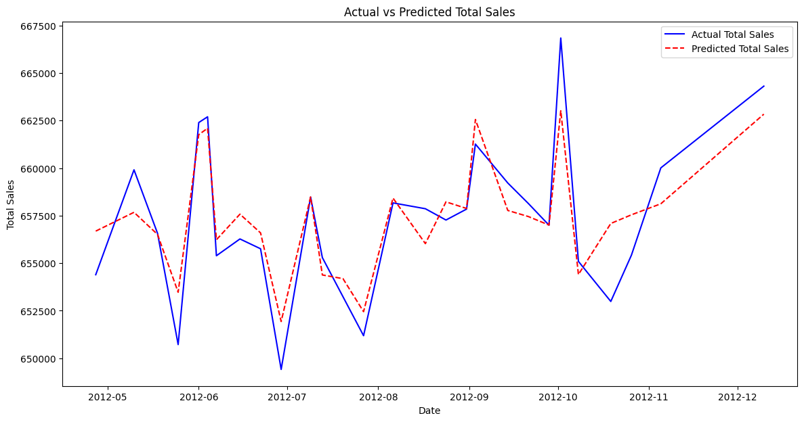
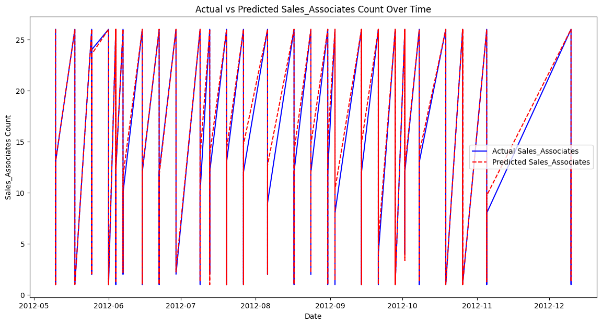
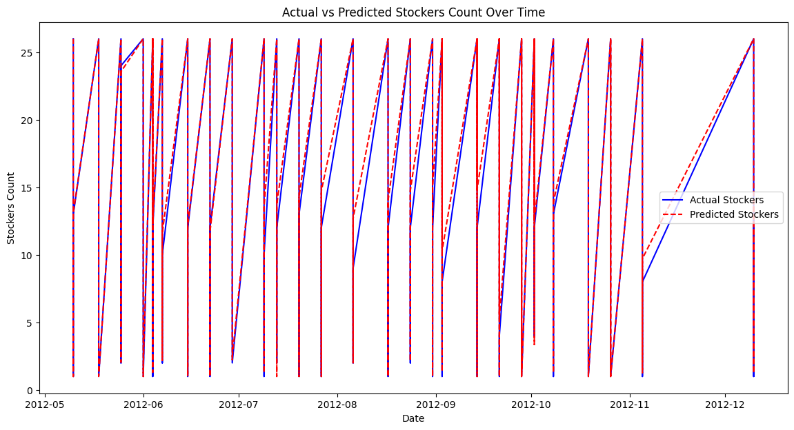

# Retail Store Staff Forecasting

## Overview

This project leverages WallMart Sales Forecast dataset to forecast sales and determine employee requirements across various store departments. By analyzing historical data on store performance, foot traffic, sales, and employee counts, the model aims to:

- **Forecast future sales** for all the store departments.
- **Predict employee requirements** based on expected foot traffic and sales volume.

## Dataset Description

The dataset includes various columns representing store metrics and employee details that can be used to forecast sales and staff needs. Below are some key columns:

- **Date**: The specific date for the data record.
- **Dept**: Department name or ID for store-specific details.
- **Cashiers**, **Sales_Associates**, **Stockers**, **Customer_Service**: Number of employees assigned to each role.
- **Total_Sales**: Total sales value for that department and day.
- **footprint**: Store foot traffic or visitor count.
- **IsHoliday**: Whether the date is a holiday (1) or not (0).
- **Type** and **Size**: Store type and size, influencing foot traffic and sales.

## Objective

The model aims to forecast sales and predict the number of employees required across key store roles (Cashiers, Sales Associates, Stockers, and Customer Service) based on forecasted sales and foot traffic trends. This helps in:

- **Ensuring optimal staffing levels** by aligning workforce needs with expected customer volume.
- **Reducing operational costs** through data-driven scheduling, thus avoiding over- or under-staffing.
- **Enhancing store performance** by ensuring adequate customer service and stocking.

## Project Structure

The project is divided into the following stages:

1. **Data Preparation and Feature Engineering**
2. **Model Training and Prediction**
3. **Performance Evaluation**
4. **Visualization of Forecasted Data**

---

## 1. Data Preparation and Feature Engineering

### Steps:

1. **Load and Clean Data**: Clean the dataset, handle missing values, and convert date columns to a datetime format.
2. **Aggregate and Transform Data**: Aggregate data by department and create additional features:
   - **Temporal Features**: Week, Month, Day of Week, Quarter, etc.
   - **Lagged and Rolling Features**: Historical and rolling averages of sales and foot traffic, allowing the model to capture trends.
3. **Define Features and Target Variables**: Identify key features for each employee role and sales forecast, including:
   - `Total_Sales`, `footprint`, `IsHoliday`, `Week`, `Month`, `Type`, `Size`, and lagged features.

## 2. Model Training and Prediction

### Modeling Approach:

Using a **Random Forest Regressor** for each employee role and sales forecast, which is suitable for capturing complex interactions in the data without overfitting. The model predicts:

- **Total Sales**: To estimate the store’s sales trends.
- **Employee Counts (Cashiers, Sales Associates, Stockers, Customer Service)**: Predict staffing needs based on sales volume and foot traffic.

### Steps:

1. **Train-Test Split**: The data is split into training and testing sets to evaluate model performance.
2. **Train the Model**: Fit the model on training data for each target variable (total sales and individual roles).
3. **Prediction**: Generate predictions for sales and employee counts on the test dataset.

## 3. Performance Evaluation

For each model, calculate performance metrics such as **Root Mean Squared Error (RMSE)** to measure accuracy and assess how closely predictions align with actual values. RMSE provides insight into the average prediction error and helps in fine-tuning model parameters.

## 4. Visualization of Forecasted Data

Visualizations help compare actual vs. predicted values over time, enabling quick insights into model accuracy and potential improvements. The visualizations include:

- **Sales Forecasting Line Charts**: Actual vs. Predicted sales for trend comparison.
- **Employee Requirement Charts**: Actual vs. Predicted employee counts for each role (Cashiers, Sales Associates, Stockers, and Customer Service) across different dates.

---

## Model Output Visualizations

Below are sample visualizations for the sales forecast and employee optimization models.

### Sales Forecast



### Employee Optimization

- **Cashiers Optimization**  
  

- **Sales Associates Optimization**  
  

- **Stockers Optimization**  
  

- **Customer Service Optimization**  
  


---

## Usage

1.  **Install Dependencies:**
    ```bash
    pip install -r requirements.txt
    ```

2. **Run the sales forecast script:**
   ```bash
   python3 sales_model.py 
   ```

3. **Run the employee optimization script:**
   ```bash
   python3 employee_model.py 
   ```


---

## Future Enhancements

In the future, I would love to improve the employee optimization model, I plan to explore integrating additional features and experimenting with more sophisticated modeling techniques. Although the current model provides basic predictions, combining employee data with other information—such as seasonality patterns, store size, promotion periods, and foot traffic fluctuations—could enhance accuracy and optimize scheduling. I’ll experiment with advanced time-series models like LSTM or Prophet to better capture trends and incorporate real-time data inputs for dynamic scheduling adjustments. 

---

## Conclusion

The Sales Forecasting and Employee Optimization Model is a powerful tool for store managers, enabling them to make informed decisions about workforce scheduling and sales trends. By using historical data, this model helps predict future staffing needs and sales, thereby supporting operational efficiency and improving customer satisfaction.

